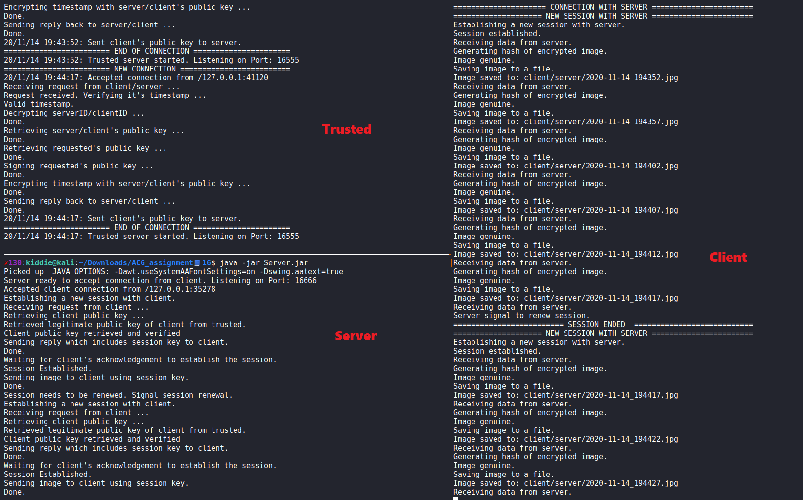

# A Self-Designed Secure File Transfer Protocol (SFTP)

Software risk assessment was conducted by doing a source code review on an client-server image transferring program given.

A new version of a SFTP client-server program is developed to address the risks identified in the original program. 

In just 9-steps, the Secure File Transfer Protocol allows:

- Servers to authenticate Client and vice versa by introducing a Public Key Authority in the protocol architecture.
- Encrypted communicaton to provide confidentiality and integrity of data transferred.
- Session renewal to ensure forward secrecy with different session keys.
- Validation of the integrity of transferred images via hash.
- Robust against Replay Attack and DOS attack.

## Table of Content

- [A Self-Designed Secure File Transfer Protocol (SFTP)](#a-self-designed-secure-file-transfer-protocol-sftp)
  - [Table of Content](#table-of-content)
  - [Background](#background)
  - [Self-designed SFTP Architecture](#self-designed-sftp-architecture)
    - [Prequisites](#prequisites)
    - [Overview of the Protocol Flow](#overview-of-the-protocol-flow)
    - [Benefits of Introducing a 3rd Party Trusted](#benefits-of-introducing-a-3rd-party-trusted)
    - [Detailed Explanation of the Protocol Flow](#detailed-explanation-of-the-protocol-flow)
  - [Setup the POC SFTP Application](#setup-the-poc-sftp-application)
    - [Compiling the different Components](#compiling-the-different-components)
    - [Running the POC SFTP Application](#running-the-poc-sftp-application)

## Background

This SFTP application is designed to transfer images from webcams all around premises to the single control room securely. Therefore, each webcam is a server and there are many servers, while the control room is the client and there is only a single client.

## Self-designed SFTP Architecture

### Prequisites

- Client and each Server are each assigned a unique ID.
- Trusted (Public-Key Authority) is trusted by all Client and Servers with Trusted's Public Key stored on them.
- Client, Server and Trusted have access to their own Public Key and Private Key.
- Trusted has a list of legitimate Client and Servers' Public Keys.
- Client has a list of IPs of Servers to connect to to retrieve images.

### Overview of the Protocol Flow

### Benefits of Introducing a 3rd Party Trusted

With the introduction of Trusted (Public Key Authority), the SFTP provides a way for Client and Servers to validate they are communicating to the legetimate Server or Client intended.

Furthermore, the Trusted solves the key management issue which arises when there are is more than one Server. Instead of the Client storing a list of legitimate Servers’ public keys and each Server storing the legitimate client’s public key, all legitimate Servers’ and Client’s Public Keys are stored on Trusted. If the Client’s Public Key pair needs to be changed for any reason, there is no need to update the Client's Public Key stored on all the Servers. Simply updating the Trusted will be necessary. This central management provided by the Public-Key Authority reduces administrative overhead and enhances security.

### Detailed Explanation of the Protocol Flow

1. **EpubT(ClientID, ServerID, T1)**
   
   With the copy of Trusted's Public Key it has, Client sends a request to Trusted, containing `ClientID`, `ServerID`and a timestamp `T1`. 
   
   This request is encrypted using Trusted's Public Key to ensure only Trusted can read the requst. It prevents the disclosure of unique IDs used in this SFTP architecture, making it harder for an adversary attack.

   Upon decryting the request using its Private Key, Trusted first verify the timestamp `T1`, making sure it is within 5 minutes of the current time, otherwise ignore the request. The timestamp is to prevent replay attack and DOS attack where an adversary captures a request packet sent from a legitimate Client and replays this packet to Trusted, improving availability of Trusted.

2. **[ServerPubKey, Signature, EpubC(T1)]**

    With the `ClientID` and `ServerID` received in `1`, Trusted retrieves the Public Key of the Server that the Client is trying to connect to and add to its response.

    Trusted then signs the Server's Public Key, allowing Client to verify the signature using Trusted's Public Key. This first allows Client to confirm the response is indeed from the real Trusted as the signature must be created from Trusted's private key. Furthermore, Client can be sure the Server's public key it received is legitimate and can be assured to use it to communicate with the Server intended.

    Trusted also encrypts the timestamp, `T1`, received in the request with the Public Key of the Client since it has a copy of all Client and Servers' Public Keys. The timestamp functions as a One-time Password (OTP) between the Client and Trusted, allowing Client to ensure the reply from Trusted is indeed the response for its request sent earlier. Otherwise, a reply captured from Trusted can from previous requests can be replayed. This further enhances the protocol's robustness against reply attack. 
    
    Moreover, the timestamp also serves as a Challenge to Trusted as being able to send `T1` back in its reply, means Trusted has successfully decrypts the request using its Private Key, proving its identity. Although Trusted's identity can also be proven by verifying the Signature, but Signature alone can't prevent reply attack.

3. **EpubS(ClientID, OTP1)**

    The Client then tries to establish a session with the intended server using a 3-way handshake.

    The Client kicks off the 3-way hanshake by first sending its `ClientID` and `OTP1`, a securely generated random one-time password as a Challenge to Server.

    The request is encrypted using the intended server's Public Key just retrieved from Trusted. If the Server is able to decrpt the request, and sending back the correct value of the `OTP1`, the Server's identity is verified. As it has the correct corresponding Private Key to the legitimate Public Key of the Server retrieved from Trusted to decrypt the request and obtain `OTP1`.

4.  **EpubT(ServerID, ClientID, T2) & [ClientPubcKey, Signature, EpubS(T2)]**

    The Server listens for incoming requests from Client. Upon receving the request from Client in `3`, the Server will decrypt it using its own Private Key.

    However, the Server also needs to ensure the Client that is trying to establish a session is the legitimate Client, otherwise the Server will be sending the sensitive webcam images to rogue Clients.

    This is where the 3rd Party Trusted come into rescue. With the `ClientID` received in `3`, the Server basically retrieves the legitimate Client's public key from Trusted the same way that Client retrieves Server's Public Key described in `1` and `2`. 
    
    Elaboration will not be done again.

5. **EpubC(SessionKey, OTP1, OTP2)**

    This is the second stage of the 3-way handshake session establishment.

    Upon retrieving the Client's Public Key from Trusted, the Server encrypts its reply using it, which contains the Session Key, `OTP2`, and `OTP1` which is obtained earlier by decrypting Client's session request in `3`.

    Like `OTP1`, `OTP2` is the Challenge by Server to Client. If Client is able to decrypt Server's reply using its Private Key to retrieve the correct value of `OTP2` and send back in `6`, then Client's identity is verified. This also proves the Client is trusted by Trusted as it has its Public Key stored and distributed by Trusted, since Client has the corresponding Private Key.

    `OTP1` and `OTP2` also serves an mechanism to prevent reply attack in the 3-way handshake session establishment. Sending the OTPs back and forth whilst checking for the same OTP is a simple way to ensure that the messages are not replayed as the OTPS are used only once during the establishing of the session (and later session renewal) and are afterwards discarded. This also ensures forward secrecy of the SFTP as compromise of a session key will not affect other sessions.

6. **Esk(SessionKey, OTP2)**

    When Client receives the reply from Server in `5`, it decrypts the reply using its Private Key. It first checks the value of the `OTP1` received is the same as the `OTP1` it sent in `3`. If they are the same, the Server's identity is verified. 

    Finally, Client will send `OTP2` encrypted using the newly received Session Key to complete the 3-way handshake to establish the session.

    Similarly, Server will decrypt Client's final ackledgement with the Session Key and verify `OTP2` is consistent with the `OTP2` generated in `5`. If they are the same, Client's identity is verified.
    
    At this stage, both the Client and Server have validated each other's identity with the help of Trusted, confirming they are talking to the legitimate intended party. 
    
    Also, a secure Session Key has been exchanged which can then be used to encrypt future session traffic between Client and Server with symmetric encryption which is much more efficient than asymmetric encryption.

    The 3-way handshake session establishment is completed and a secure session is created between Client and Server.

7. **[Esk(Image), Hash]**

    After the session is established, the Client starts to listen for image traffic from the Server, encrypted with Session Key. 
    
    The encrypted image is hashed on the Client side and compared to the hash that was sent. If they are identical, the encrypted data has not been modified and thus retains image's integrity. 

    The hash is the hash of the encrypted version of the image. If the hash does not match, then Client will not even attempt to decrypt the image, saving computing resources.

8. **Esk(OTP1)**

    After every 60 images are sent from Server to Client, the Server will initiate a session renewal request by sending the `OTP1` again. Client will initiate the 3-way handshake session establishment process again, described in `3`. Client and Server validates each other's identity again using a new `OTP1` and `OTP2`. 

    This session renewal feature greatly improves the security of this self-design SFTP as bruteforcing session keys are nearly impossible and even attacker managed to compromise a session key, at most, he will only gain access to 60 images, leaving the rest of communication protected.

## Setup the POC SFTP Application

Manifest files have been created for each program `mfclient.txt, mfserver.txt & mftrust.txt` in `Source Code` folder for Client, Server and Trusted respectively.

### Compiling the different Components
Compiling the Client:
1. javac Client.java
2. jar -cvfm Client.jar mfclient.txt Client.class

Compiling the Server:
1. javac Server.java
2. jar -cvfm Server.jar mfserver.txt Server.class

Compiling the Trusted:
1. javac Trusted.java
2. jar -cvfm Trusted.jar mftrust.txt Trusted.class

### Running the POC SFTP Application

Ensure "client", "server", "trusted" folders are in the same directory.

> Order of Running: Trusted.jar > Server.jar > Client.jar

In CMD1:

1. java -jar Trusted.jar

In CMD2:

2. java -jar Server.jar

In CMD3:

3. java -jar Client.jar server [Client Usage: java ./Client <ServerID>]

    Press Ctrl+C to stop Client.  

> NOTE: If the original supplied .JAR files throws an error
when trying to run them, please recompile the files
with the steps above. This may be caused due to a
different runtime/compiler versions

Images sent from Server will be stored in `Source Code/client/server/`.

Images to be sent from Server are stored in `Source Code/server/images/`.